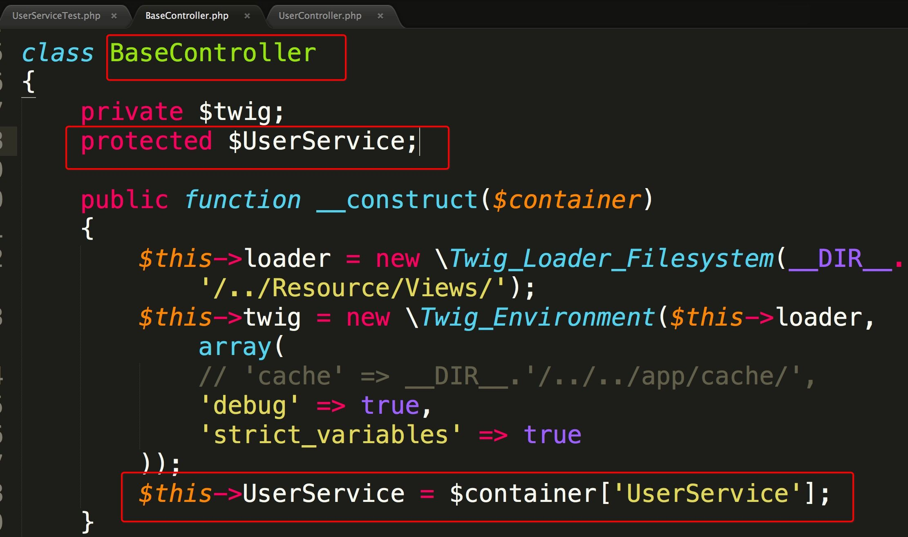

##day8codereview

*1* 基类不能依赖具体的实现。

 

*2* 命名要清晰

    getUserDao改成userDao

*3*  成功的提示框尽量采用"无需点击"的弹框

*4* 通用的方法要统一移到基类下面

*5* 遵循单一职责，一个方法不要做太多事情

##惩罚
*1* 唐杨选手  5个俯卧撑(day7的20俯卧撑) <--> 2分钟的平板支撑
*2* 李静文选手 3分钟平板支撑